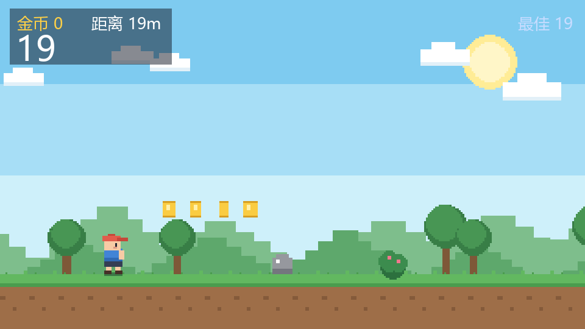
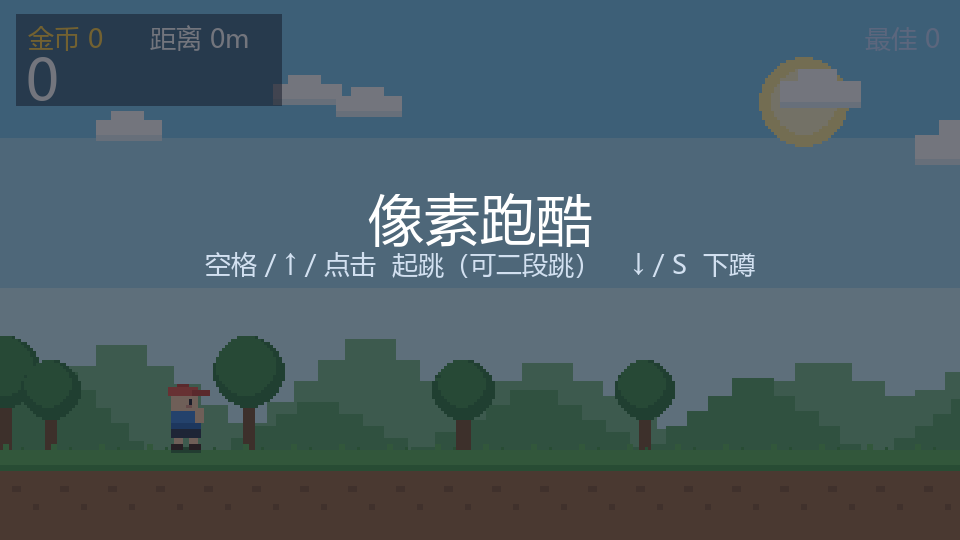
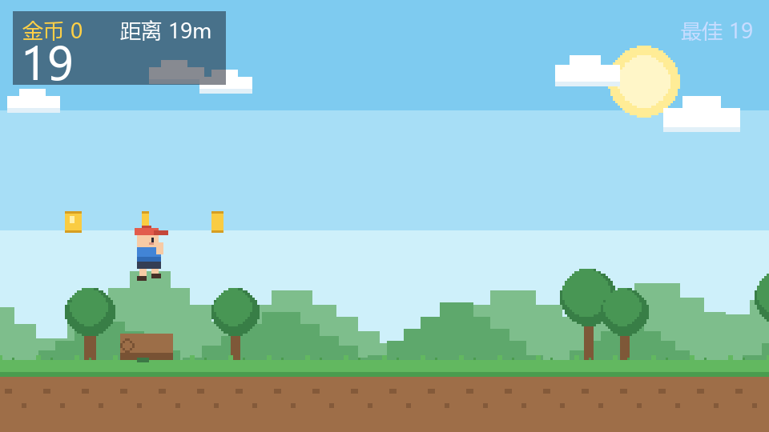
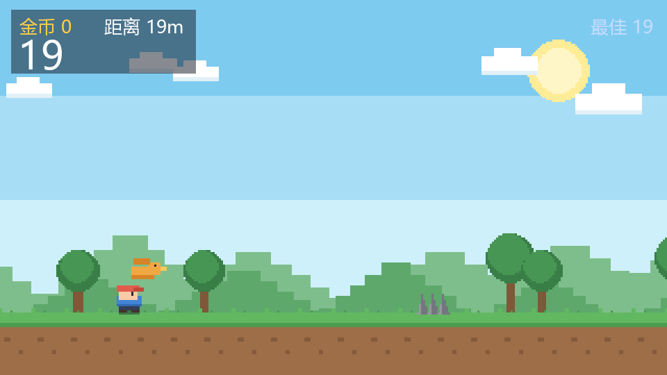
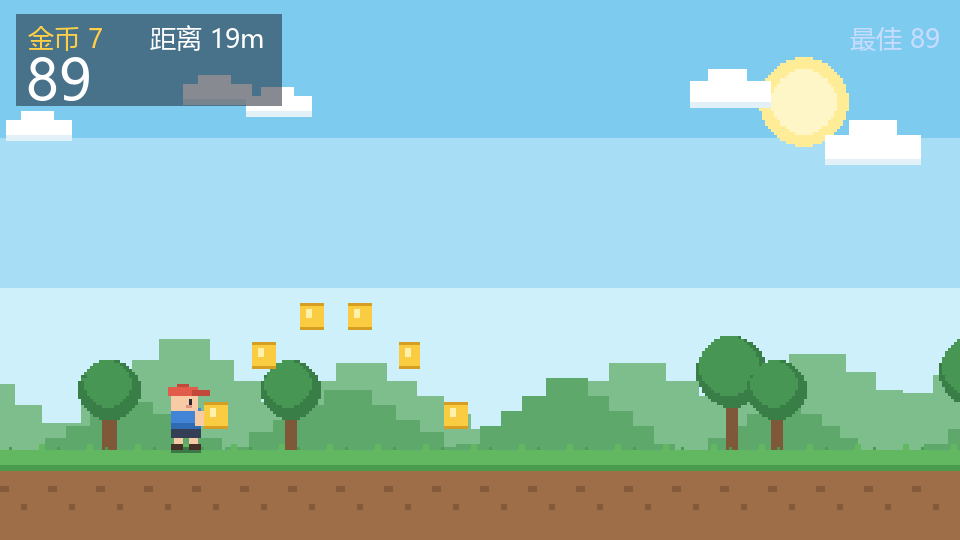
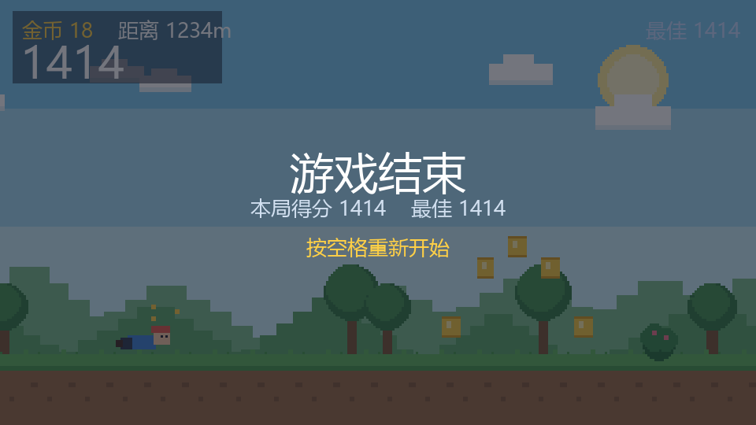

# Pixel Parkour 像素跑酷

一个用 **pygame** 写的横版无尽跑酷小游戏，像素卡通户外风格：蓝天、白云、远山、绿树、草地，角色自动向前奔跑，你只负责跳和下蹲。



## 玩法

- 角色自动前进，速度随距离越来越快；
- 跳过地面的岩石 / 原木 / 灌木 / 尖刺；
- 下蹲躲开低空掠过的小鸟；
- 吃金币加分（1 枚 = 10 分），分数 = 距离(米) + 金币×10；
- 支持**二段跳**；
- 撞到障碍即结束，按空格重开，进程内记录最佳成绩。

## 操作

| 动作 | 按键 |
| --- | --- |
| 起跳 / 二段跳 / 重开 | `空格` / `↑` / `W` / 鼠标左键 |
| 下蹲（按住） | `↓` / `S` |
| 退出 | `Esc` |

## 运行

### 依赖

- Python 3.9+
- `pygame` 或 `pygame-ce`（推荐 `pygame-ce`，API 兼容）
- `numpy`（**可选**，仅用于合成音效；缺失时自动静音，不会崩）

```bash
pip install -r requirements.txt
```

### 一键启动

| 平台 | 命令 |
| --- | --- |
| Windows | 双击 `run.bat` |
| macOS / Linux | `chmod +x run.sh && ./run.sh` |

启动脚本会自动探测可用的解释器，并在 `pygame` 缺失时尝试安装 `pygame-ce`。

### 手动启动

```bash
python game.py
```

> **维护提示**：`run.bat` 必须保持**纯 ASCII + CRLF 行尾、不含 BOM**。
> cmd.exe 默认用系统代码页（中文 Windows 为 GBK/CP936）读取批处理文件，
> 一旦混入 UTF-8 中文，多字节序列会被错误解码并把命令行切碎，
> 表现为 `'or' / 'install' / '[ERROR]' 不是内部或外部命令` 一类报错。
> 需要改提示语时请只用英文。

## 项目结构

```
game.py               单文件主体（逻辑 + 渲染，逻辑与渲染分离便于无头测试）
run.bat / run.sh      启动脚本
selftest.py           无头自检（SDL dummy），覆盖物理/生成/碰撞/渲染/真实主循环
make_screenshots.py   出图脚本，生成 screenshots/ 关键画面
requirements.txt      依赖清单
LICENSE               MIT
.gitignore / .gitattributes
```

## 自检与出图

```bash
python selftest.py          # 无头跑全部规则，全绿即通过
python make_screenshots.py  # 重新生成 screenshots/*.png
```

`selftest.py` 会用 `--autostart --autoquit-frames` 真跑一遍 `main()` 的事件循环，
确保真实输入路径（而非仅逻辑层）也不会崩。

## 想改造的话

| 想改的东西 | 改哪里 |
| --- | --- |
| 初始 / 最大速度、加速曲线 | `BASE_SPEED` / `MAX_SPEED` / `SPEED_K` |
| 重力与跳跃手感 | `GRAVITY` / `JUMP_V`（二段跳力度为 `JUMP_V * 0.86`） |
| 障碍种类与尺寸 | `OBSTACLES` 字典，地面种类在 `GROUND_KINDS` |
| 障碍生成密度 | `_spawn()` 里的 `t_gap` 与 `gap = max(110.0, ...)` |
| 小鸟出现比例 | `_pick_obstacle()` 里的 `bird_p` |
| 金币阵型 | `_spawn_coin_pattern()`（横排 / 拱形 / 竖列三种） |
| 金币分值 | `score()` 里的 `self.coins * 10`（改完同步上面「玩法」一节） |
| 像素画布分辨率 / 放大倍率 | `LW, LH` / `SCALE` |
| 配色（天空、草地、角色、障碍） | 文件顶部的颜色常量区 |
| 角色外观 | `_draw_player()` / `_draw_player_dead()` |

## 画面

| 待机 | 奔跑 | 跳跃 |
| --- | --- | --- |
|  |  |  |

| 下蹲躲鸟 | 金币 | 结束 |
| --- | --- | --- |
|  |  |  |

## 许可

MIT，见 [LICENSE](LICENSE)。
